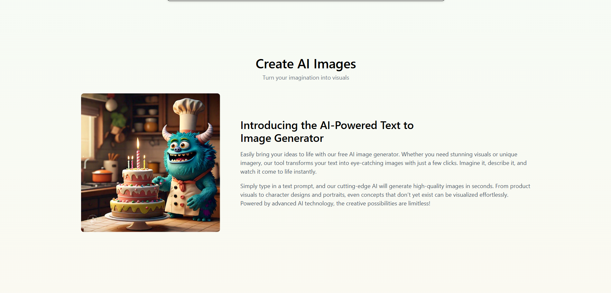
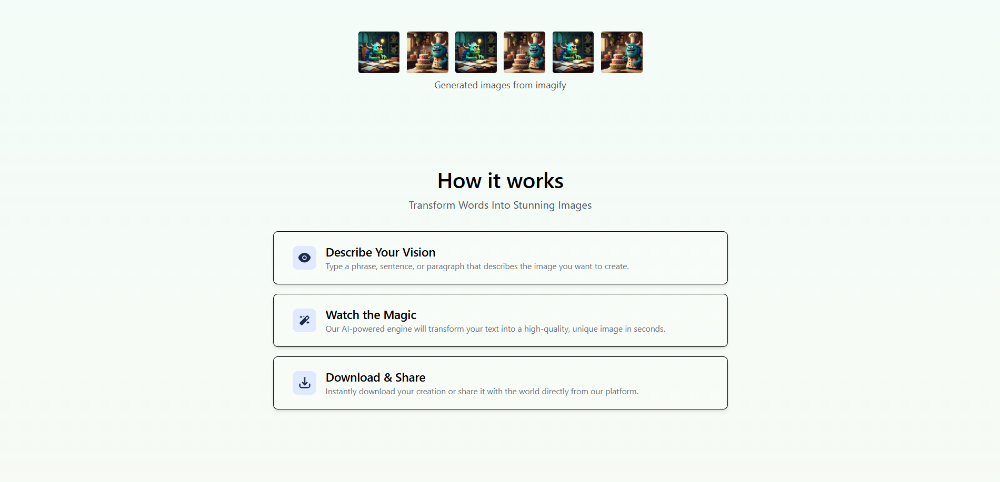
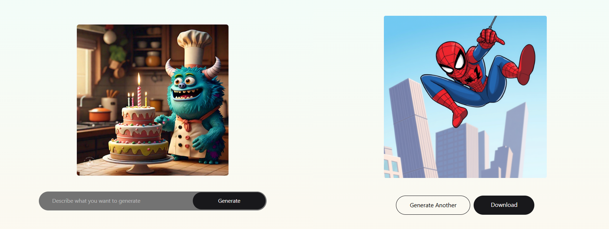
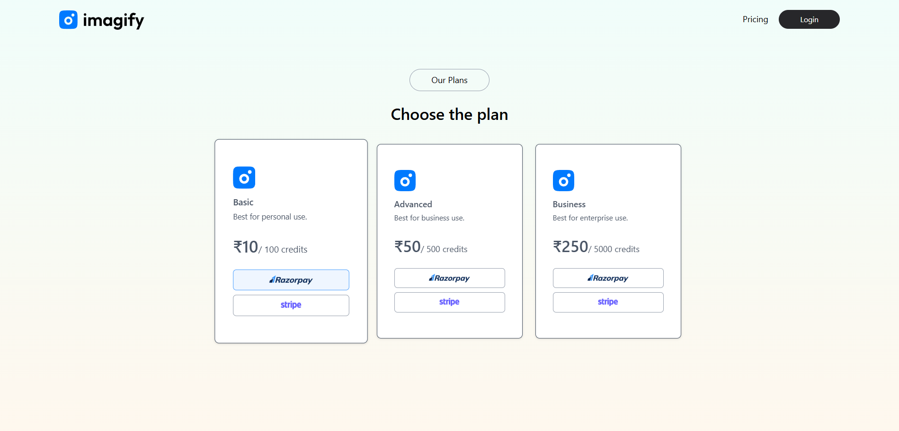

📸 Imagify – AI Text to Image Generator

Imagify is a full-stack web application that allows users to generate stunning images from text prompts using AI. Users can register, log in, generate images, and purchase credits via Razorpay or Stripe.

🚀 Features

🔑 User authentication (register/login)

🖼️ Generate images from text prompts using AI (Clipdrop API)

💳 Credit-based usage system

🛒 Purchase credits via Razorpay or Stripe

🎨 Responsive and modern UI built with React + Tailwind CSS

🔔 Toast notifications for smooth user feedback

🖼️ Demo

Here’s an example of images generated by Imagify:

🛠️ Tech Stack

Frontend: React, Vite, Tailwind CSS, Framer Motion, Axios, React Router, React Toastify

Backend: Node.js, Express, MongoDB, Mongoose, Razorpay, Stripe, JWT, Bcrypt

APIs: Clipdrop (for AI image generation)

**Secreenshot**

